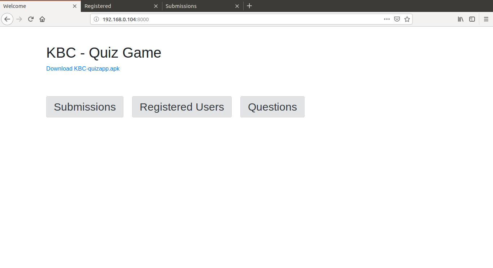
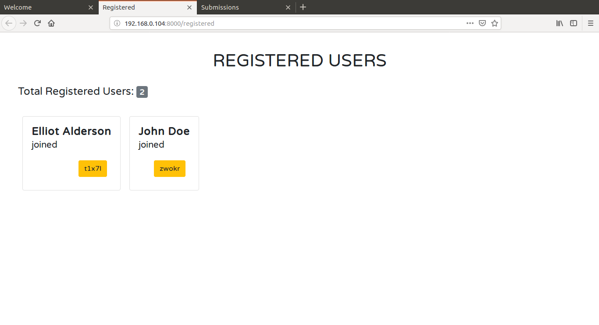
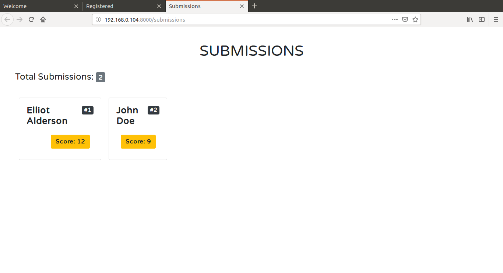

It's a simple **Server + Android App** system which can be used to conduct a quiz game for a relatively
moderate amount of users. This enables a group of participants to sit together and play a quiz game on their phones and find out who scored the most. 

This repository contains the code for the server written in **Python3** using the
**Flask** framework. It just provides a REST API to be used by the app and some web pages that help the host
conduct the quiz game. 

## Motivation 

This project is named after the show "Kaun Banega Crorepati" or "KBC". I built this because my housing society wanted to conduct a small quiz event for the children on the eve of Children's Day 2018.

<br>

## How to start the server ?

### Dependencies 

1. Python3
2. Flask

### To install the dependencies:
 
run `pip3 install -r requirements.txt`
> NOTE: use `pip` or `pip3` as specified in your operating system


## To start the server:
1. Add your local ip on the first lines of `static/js/registered.js` and `static/js/submissions.js`
2. The run `python3 app.py`

> NOTE: Don't forget the first step, else your js won't have a valid ip to make requests to.

After this you will be able to view it on `http://<your ip>:8000/` in your browser.

The .apk file is available [here](static/KBC-quizapp.apk)

The code for the app is availabe on : https://github.com/junaidrahim/KBC-Quiz-App

<br>

## Screenshots : 

### Index Page
 <br>

### Registered Users
 <br>

### Submissions
 


> NOTE: The js won't execute if you do `localhost` due to same origin policy, instead put the ip of your pc/server.

<br><br>

## How does this Work ?

Well, the basics are pretty simple. This repository has the code for the server. You start the server
and then use an android app that makes appropriate requests to the server and you get to conduct your game.

Check the players who registered on the page `http://localhost:8000/resgistered`

And then you can check/display the submissions on the page `http://localhost:8000/submissions`. The javascript
on this page will fetch the submission data, add up the scores and sort the players, and display them in ranks
accordingly.

### Directory Structure

```bash
├── app.py
├── LICENSE
├── README.md
├── requirements.txt
├── screenshots
│   ├── header.png
│   ├── index.png
│   ├── registered.png
│   └── submissions.png
├── static
│   ├── css
│   │   ├── index.css
│   │   ├── registered.css
│   │   └── submissions.css
│   ├── js
│   │   ├── jquery.min.js
│   │   ├── registered.js
│   │   └── submissions.js
│   └── KBC-quizapp.apk
└── templates
    ├── index.html
    ├── questions.html
    ├── registered.html
    └── submissions.html

5 directories, 19 files
```

### Web Pages Available:

1. `http://localhost:8000/`. This is the main **Homepage.**
2. `http://localhost:8000/resgistered` . This page shows the **Registered users** (updates in real time).
3. `http://localhost:8000/submissions` . This page shows the **Submissions**. (updates in real time)
4. `http://localhost:8000/questions` . This page can be used to display the questions to the audience after the quiz is over

> Note: Replace `localhost` with the ip of your computer on the network

<br>

### API Details:

* **URL** : `/api/post/register`

    * Method : `POST`
    * Description : Will register the user and send a unique id.
    * Required Params : `name=[string]`
    * Sample Request : `{ "name" : "John Doe" }`
    * Success Response : `{ "success":True, "id":"<some unique id>", "error": "none" }`
    * Error Response : `{ "success":False, "error": <details about the error> }`

* **URL** : `/api/post/delete_registration`

    * Method : `POST`
    * Description: Will delete the user whose corresponding details were sent.
    * Required Params : `name=[string], id=[string]`
    * Sample Request : `{ "name" : "John Doe", "id":"89jes1s" }`
    * Success Response : `{ "success":True, "error":"none" }`
    * Error Response : `{ "success":False, "error":"request to delete a non-existing user" }`


* **URL** : `/api/post/submission`

    * Method : `POST`
    * Description : Will append the score sent for the corresponding user. Total score will be the sum of the array
    * Required Params : `name=[string], id=[string], score=[int]`
    * Sample Request : `{ "name" : "John Doe", "id":"89jes1s", "score": 4 }`
    * Success Response : `{ "success":True, "error":"none" }`
    * Error Response : `{"success":False, "error": "User is not registered"}`

* **URL** : `/api/get/registered_users`

    * Method : `GET`
    * Description : Will return details of all the registered users in the following json format
    * Required Params : `none`
    * Success Response : 
        ```json
        {
            "t1x7l": "Elliot Alderson",
            "zwokr": "John Doe"
        }
        ```

* **URL** : `/api/get/submissions`

    * Method : `GET`
    * Description : Will return the submissions of all the users in the following json format.
    * Required Params : `none`
    * Success Response : 
        ```json
        {   
            "t1x7l": [ "Elliot Alderson", [3, 4, 0, 0, 0, 5] ],
            "zwokr": [ "John Doe", [4, 0, 0, 0, 2, 3] ]
        }
        ```

<br>

## Note to the Reader

This is a very dead simple project to conduct the game. My userbase was like 20 so I kept it simple 😅. This needs a lot of improvement and security features, it will work fine if you're using this in a closed network for 
limited amount of people.

## Features to be implemented :

We will have to add a lot of features to make this system a solid one. Some of them are below, I am always open to new suggestions and PRs. 😁✌️

- [ ] Database Support, probably mongodb
- [ ] Adding more security to the API
- [ ] More Sophisticated Authentication
- [ ] A cap on max amount of score the API accepts.


## LICENSE

Copyright(c) **Junaid H Rahim**. All Rights Reserved

Licensed under the [MIT](LICENSE) License.

[](https://forthebadge.com)
[](https://forthebadge.com)
[](https://forthebadge.com)

Header Icon made by <a href="https://www.flaticon.com/authors/prosymbols" title="Prosymbols">Prosymbols</a> from <a href="https://www.flaticon.com/" title="Flaticon">www.flaticon.com</a>